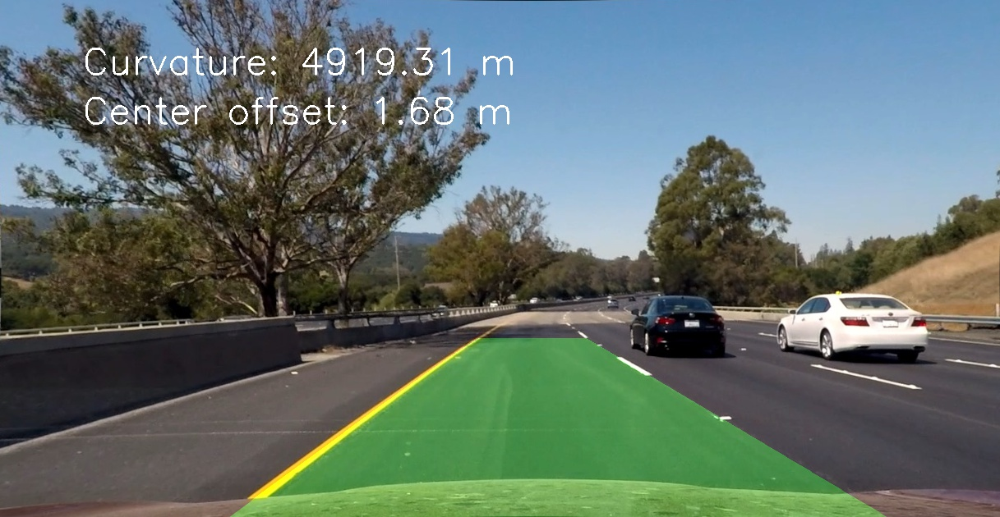

## Advanced Lane Finding

In this project, your goal is to write a software pipeline to identify the lane boundaries in a video
The write up for this project is in [writeup_template.md](writeup_template.md)

The code for this project is included in the [IPython notebook](P2.ipynb)

The final video output is [available here](test_videos_output/project_video.mp4)

The Project
---

The goals / steps of this project are the following:

* Compute the camera calibration matrix and distortion coefficients given a set of chessboard images.
* Apply a distortion correction to raw images.
* Use color transforms, gradients, etc., to create a thresholded binary image.
* Apply a perspective transform to rectify binary image ("birds-eye view").
* Detect lane pixels and fit to find the lane boundary.
* Determine the curvature of the lane and vehicle position with respect to center.
* Warp the detected lane boundaries back onto the original image.
* Output visual display of the lane boundaries and numerical estimation of lane curvature and vehicle position.
